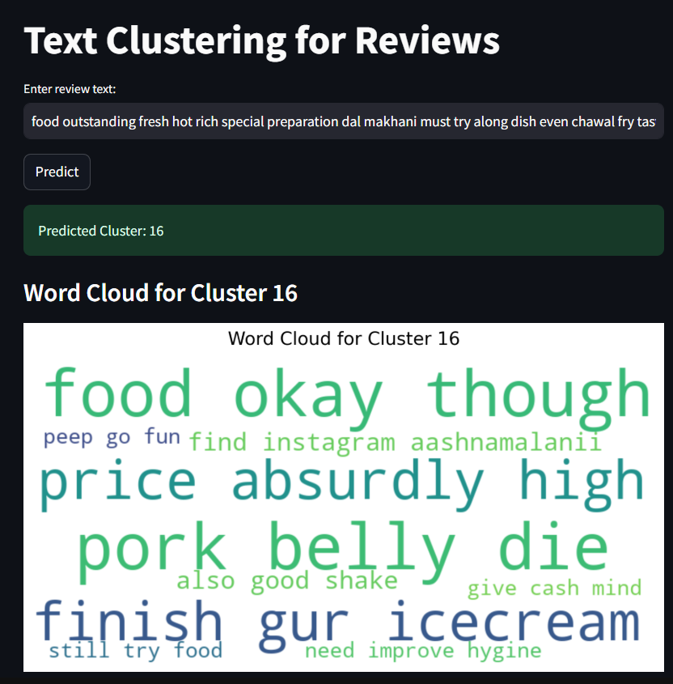

# New Delhi Reviews - Clustering and Analysis

This project aims to preprocess textual reviews, cluster them into meaningful groups, and extract top keywords for each cluster to provide insights. The workflow includes data preprocessing, feature engineering, clustering, and keyword extraction.

---
## This is the architecture for this ML System

---
## **Project Workflow**

### **1. Data Collection**
- Reviews were collected from a dataset consisting of user-generated content.

### **2. Text Preprocessing**
The reviews were preprocessed using the following steps:

1. **Lowercasing**:
   - Converted all text to lowercase to ensure uniformity.

2. **Tokenization**:
   - Split text into individual words using **NLTK** (Natural Language Toolkit).

3. **Lemmatization**:
   - Reduced words to their base or root form using NLTK's WordNetLemmatizer to normalize the text.

### **3. Feature Engineering**

1. **Word2Vec Model**:
   - Developed a custom **Word2Vec** model on the corpus.
   - Each review was represented as a 25-dimensional vector, capturing semantic and syntactic information about the words.

### **4. Clustering**

1. **K-Means Clustering**:
   - Used the K-Means algorithm to cluster the reviews into distinct groups based on their 25-dimensional Word2Vec embeddings.
   - The number of clusters was determined based on domain knowledge or the elbow method.

### **5. Keyword Extraction**

1. **RAKE (Rapid Automatic Keyword Extraction)**:
   - Used RAKE from NLTK to extract meaningful keywords for each cluster.
   - Configured RAKE to focus on phrases with a minimum length of 3 words and exclude repeated phrases.
   - Extracted the top 10 keywords for each cluster to summarize its central theme.

---

## **Directory Structure**

```
New_Delhi_Reviews/
├── artifacts/              # Contains saved models and keyword JSONs
├── notebooks/              # Jupyter notebooks for data exploration and ingestion
│   ├── 01_data_ingestion.ipynb
│   ├── 02_EDA.ipynb
│   ├── 03_data_transformation.ipynb
│   ├── 04_model_building.ipynb
│   ├── 05_topic_modelling.ipynb
├── src/                    # Source code
│   ├── components/         # Modular components
│   │   ├── __init__.py
│   │   ├── data_ingestion.py
│   │   ├── data_transformation.py
│   │   ├── data_clustering.py
│   ├── pipelines/          # Prediction and preprocessing 
│   │   ├── prediction_pipeline.py
│   │   ├── training_pipeline.py
│   │   ├── __init__.py
│   ├── __init__.py         # Package initialization
│   ├── constants.py        # data columns and names
│   ├── db_paths.py         # data base details
│   ├── logger.py           # Logging utility
├── requirements.txt        # Python dependencies
├── LICENSE                 # License file
├── README.md               # Project documentation
└── Screenshot.png          # Sample visualization
```

---

## **Key Files**

1. **`src/frontend.py`**:
   - A Streamlit-based interface to input text reviews and predict their cluster.
   - Displays a word cloud for the predicted cluster using precomputed keywords.

2. **`src/pipelines/prediction_pipeline.py`**:
   - Contains the logic for loading the preprocessor and clustering model.
   - Implements `CustomData` and `PredictPipeline` classes.

3. **`artifacts/cluster_keywords.json`**:
   - Precomputed top keywords for each cluster, used for word cloud generation.

---

## **How to Run the Project**

1. **Setup Environment**:
   ```bash
   pip install -r requirements.txt
   ```

2. **Run the Streamlit App**:
   ```bash
   python src/frontend.py
   ```

3. **Input a Review**:
   - Enter a review into the text box.
   - The app will predict its cluster and display a word cloud for the cluster's top keywords.

4. **Sample Output**:
   Below is a screenshot showcasing the word cloud generated for one of the clusters:

   

---

## **Future Enhancements**

1. Add sentiment analysis for deeper insights into the reviews.
2. Integrate a database to handle larger datasets dynamically.
3. Improve clustering by experimenting with advanced models like DBSCAN or hierarchical clustering.
4. Visualize clusters using dimensionality reduction techniques like t-SNE or UMAP.


